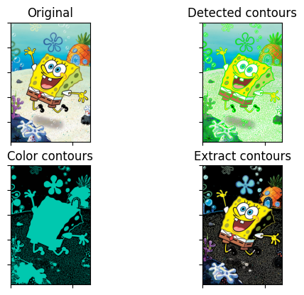

<h1>
 Tugas 12</h1> 

<table align="center">
  <tr>
    <th colspan="2">DATA MAHASISWA</th>
  </tr>
  <tr>
    <td>Nama</td>
    <td>Hilman Ihza Amrullah</td>
  </tr>
  <tr>
    <td>NIM</td>
    <td>312210310</td>
  </tr>
  <tr>
    <td>Kelas</td>
    <td>TI.22.A3</td>
  </tr>
</table>
 
<h2>Ini Output Latihan</h2>

 
<h2>Ini Output Latihan Copy</h2>

